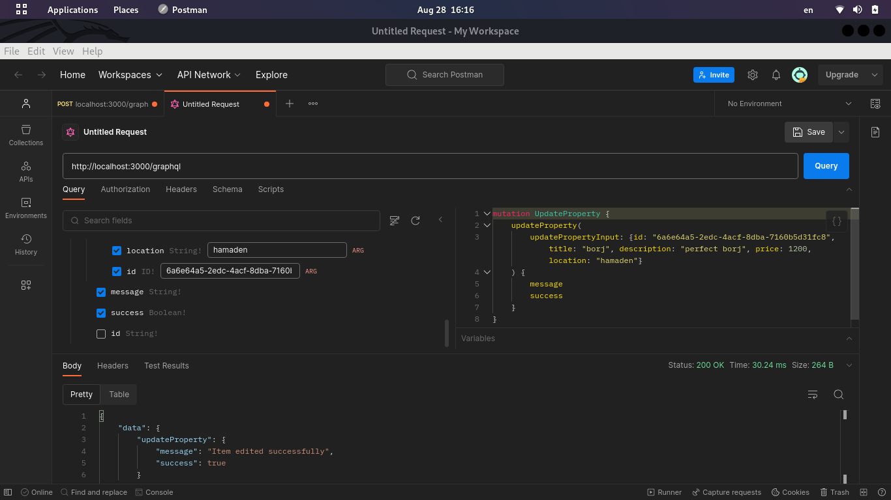
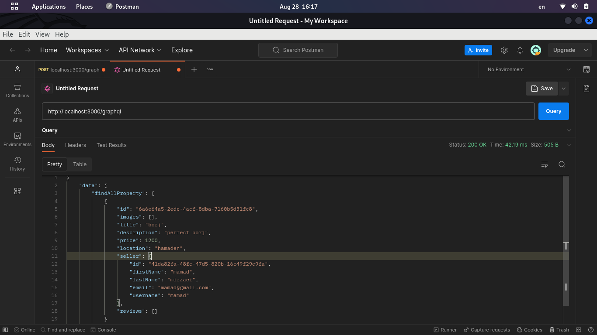
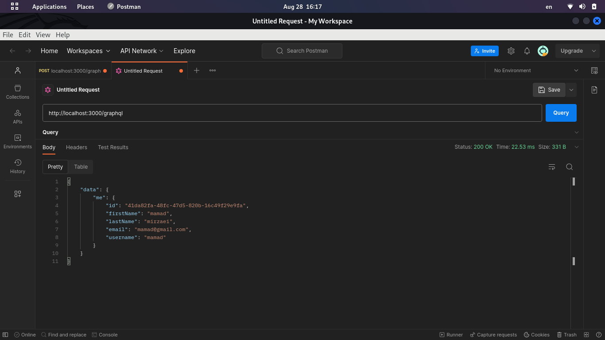
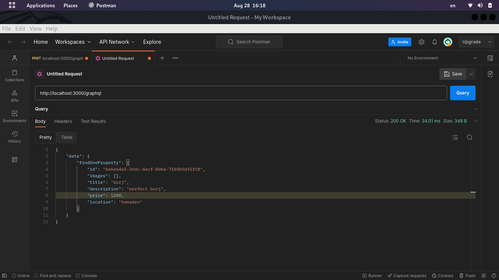
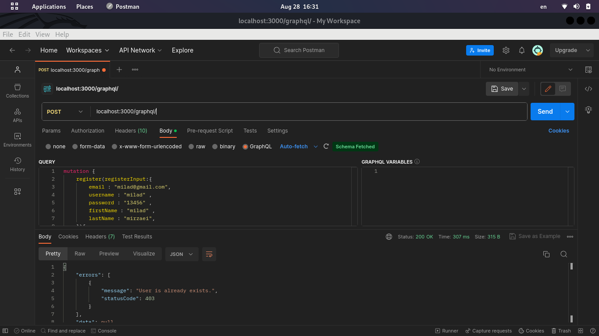
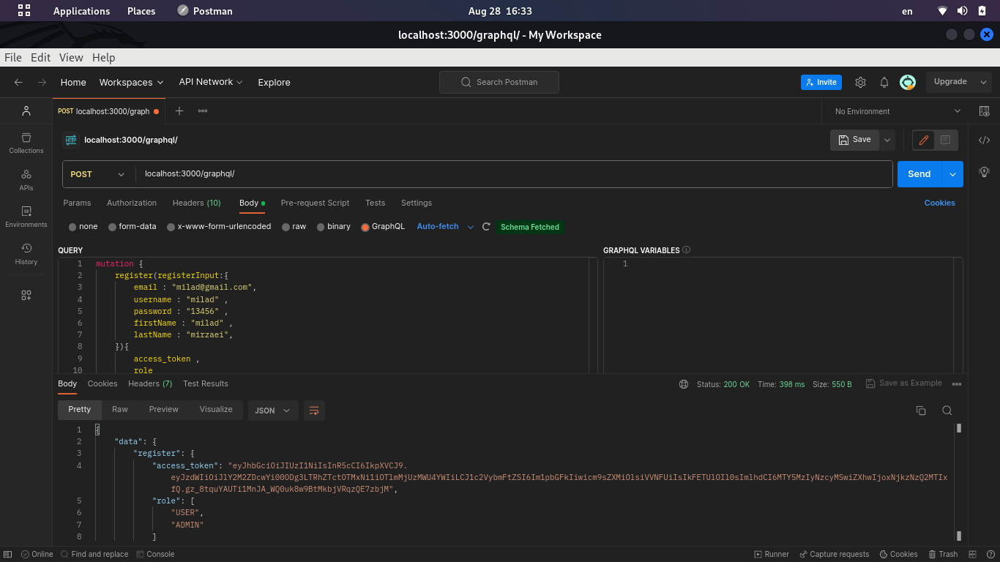
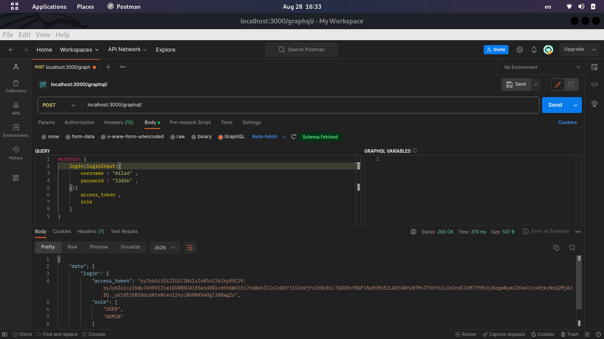

# Property Listing Website with GraphQL

This project is a property listing website that utilizes GraphQL in TypeScript for querying property data and performing mutations for user interactions. Users can search for properties, view property details, and contact sellers.

## Features

- Search for properties based on criteria such as location, price range, and property type.
- View detailed information about a specific property.
- Contact property sellers to inquire about properties.


## Demo















## Getting Started

### Prerequisites

- Node.js (v14 or later)
- npm or Yarn

### Installation

Clone this repository:

```bash
git clone https://github.com/basemax/GraphQLRealEstateTS.git
```

Navigate to the project directory:

```bash
cd GraphQLRealEstateTS
```

Install dependencies:

```bash
npm install
# or
yarn install
```

## Usage

- Running the Server
- Create a `.env` file in the root directory and provide necessary environment variables (such as database connection details).

Start the server:

```bash
npm run start:dev
# or
yarn start
```

## GraphQL Playground

You can access the GraphQL Playground by visiting `http://localhost:3000/graphql` in your browser. This interactive interface allows you to execute queries and mutations.

## GraphQL Queries and Mutations

| Operation       | Description                                                          | Example Usage |
|-----------------|----------------------------------------------------------------------|---------------|
| **Queries**     |                                                                      |               |
| `searchProperties` | Retrieve a list of properties based on search criteria.           | `searchProperties(location: "City", minPrice: 100000, maxPrice: 500000)` |
| `getPropertyDetails` | Retrieve detailed information about a specific property.           | `getPropertyDetails(propertyId: "property_id_here")` |
| `getUserFavorites` | Get a user's list of favorite properties.                          | `getUserFavorites(userId: "user_id_here")` |
| `getFeaturedProperties` | Retrieve a list of featured properties for display.             | `getFeaturedProperties` |
| `getNearestProperties` | Get properties near a specific location.                         | `getNearestProperties(latitude: 40.7128, longitude: -74.0060, radius: 10)` |
| `getSimilarProperties` | Get properties similar to a given property.                      | `getSimilarProperties(propertyId: "property_id_here")` |
| `getRecentProperties` | Retrieve a list of recently added properties.                   | `getRecentProperties(limit: 10)` |
| `getPropertyReviews` | Get reviews for a specific property.                             | `getPropertyReviews(propertyId: "property_id_here")` |
| `getTrendingLocations` | Retrieve trending property locations.                           | `getTrendingLocations(limit: 5)` |
| `getPropertyImages` | Get images associated with a property.                          | `getPropertyImages(propertyId: "property_id_here")` |
| `getAgentProfile` | Get profile information for a property agent.                   | `getAgentProfile(agentId: "agent_id_here")` |
| `getAvailableCities` | Retrieve a list of cities with available properties.           | `getAvailableCities` |
| `getPropertyTypes` | Get a list of property types available.                        | `getPropertyTypes` |
| `getUserActivity` | Get recent activity for a specific user.                       | `getUserActivity(userId: "user_id_here", limit: 10)` |
| `getPropertyBookings` | Get bookings for a specific property.                         | `getPropertyBookings(propertyId: "property_id_here")` |
| `getUserBookings` | Get bookings made by a specific user.                         | `getUserBookings(userId: "user_id_here")` |
| `getPropertyPayments` | Get payment history for a specific property.                 | `getPropertyPayments(propertyId: "property_id_here")` |
| `getUserNotifications` | Get notifications for a specific user.                      | `getUserNotifications(userId: "user_id_here")` |
| `getUnreadNotifications` | Get unread notifications for a specific user.             | `getUnreadNotifications(userId: "user_id_here")` |
| `getUnreadMessages` | Get unread messages for a specific user.                 | `getUnreadMessages(userId: "user_id_here")` |
| `getUserChats` | Get chats and messages for a specific user.              | `getUserChats(userId: "user_id_here")` |
| **Mutations**   |                                                                      |               |
| `contactSeller` | Send a message to the property seller.                             | `contactSeller(propertyId: "property_id_here", message: "Interested in the property.")` |
| `addToFavorites` | Add a property to a user's list of favorites.                     | `addToFavorites(userId: "user_id_here", propertyId: "property_id_here")` |
| `removeFromFavorites` | Remove a property from a user's list of favorites.            | `removeFromFavorites(userId: "user_id_here", propertyId: "property_id_here")` |
| `createProperty` | Create a new property listing.                                    | `createProperty(input: { title: "New Property", location: "City", price: 200000 })` |
| `updateProperty` | Update details of a property.                                    | `updateProperty(propertyId: "property_id_here", input: { price: 210000 })` |
| `deleteProperty` | Delete a property listing.                                       | `deleteProperty(propertyId: "property_id_here")` |
| `addPropertyReview` | Add a review for a property.                                   | `addPropertyReview(propertyId: "property_id_here", review: "Great property!")` |
| `updateUserProfile` | Update user profile information.                                | `updateUserProfile(userId: "user_id_here", input: { name: "New Name" })` |
| `registerUser` | Register a new user account.                                    | `registerUser(input: { username: "new_user", email: "user@example.com", password: "password" })` |
| `loginUser` | Log in a user and get an authentication token.                  | `loginUser(email: "user@example.com", password: "password")` |
| `logoutUser` | Log out a user and invalidate their token.                     | `logoutUser` |
| `contactSeller` | Send a message to the property seller.                             | `contactSeller(propertyId: "property_id_here", message: "Interested in the property.")` |
| `addToFavorites` | Add a property to a user's list of favorites.                     | `addToFavorites(userId: "user_id_here", propertyId: "property_id_here")` |
| `removeFromFavorites` | Remove a property from a user's list of favorites.            | `removeFromFavorites(userId: "user_id_here", propertyId: "property_id_here")` |
| `createProperty` | Create a new property listing.                                    | `createProperty(input: { title: "New Property", location: "City", price: 200000 })` |
| `updateProperty` | Update details of a property.                                    | `updateProperty(propertyId: "property_id_here", input: { price: 210000 })` |
| `deleteProperty` | Delete a property listing.                                       | `deleteProperty(propertyId: "property_id_here")` |
| `addPropertyReview` | Add a review for a property.                                   | `addPropertyReview(propertyId: "property_id_here", review: "Great property!")` |
| `updateUserProfile` | Update user profile information.                                | `updateUserProfile(userId: "user_id_here", input: { name: "New Name" })` |
| `registerUser` | Register a new user account.                                    | `registerUser(input: { username: "new_user", email: "user@example.com", password: "password" })` |
| `loginUser` | Log in a user and get an authentication token.                  | `loginUser(email: "user@example.com", password: "password")` |
| `logoutUser` | Log out a user and invalidate their token.                     | `logoutUser` |
| `createReview` | Create a review for a property.                                | `createReview(input: { propertyId: "property_id_here", rating: 4, comment: "Great property!" })` |
| `updateReview` | Update a review's content.                                    | `updateReview(reviewId: "review_id_here", input: { comment: "Updated comment" })` |
| `deleteReview` | Delete a review.                                             | `deleteReview(reviewId: "review_id_here")` |
| `createUserReport` | Create a report on a user's activity.                        | `createUserReport(input: { userId: "user_id_here", reason: "Inappropriate behavior" })` |
| `updateUserReport` | Update the status of a user report.                         | `updateUserReport(reportId: "report_id_here", status: RESOLVED)` |
| `createMessage` | Create a message for communication.                         | `createMessage(input: { senderId: "user_id_here", recipientId: "other_user_id", content: "Hello!" })` |
| `updateMessageStatus` | Update the status of a message.                         | `updateMessageStatus(messageId: "message_id_here", status: READ)` |
| `createBooking` | Create a booking for a property.                         | `createBooking(input: { userId: "user_id_here", propertyId: "property_id_here", startDate: "2023-09-01", endDate: "2023-09-10" })` |
| `updateBooking` | Update a booking's details.                         | `updateBooking(bookingId: "booking_id_here", input: { startDate: "2023-09-02" })` |
| `cancelBooking` | Cancel a booking.                         | `cancelBooking(bookingId: "booking_id_here")` |
| `createPayment` | Create a payment for a booking.                         | `createPayment(input: { bookingId: "booking_id_here", amount: 500 })` |
| `refundPayment` | Refund a payment.                         | `refundPayment(paymentId: "payment_id_here")` |
| `createNotification` | Create a notification for a user.                         | `createNotification(input: { userId: "user_id_here", message: "New property available!" })` |
| `markNotificationAsRead` | Mark a notification as read.                         | `markNotificationAsRead(notificationId: "notification_id_here")` |

## GraphQL Schema

### Queries

Search Properties: Retrieve a list of properties based on search criteria.

```graphql
query SearchProperties($location: String, $minPrice: Float, $maxPrice: Float, $propertyType: String) {
  searchProperties(location: $location, minPrice: $minPrice, maxPrice: $maxPrice, propertyType: $propertyType) {
    id
    title
    location
    price
    propertyType
  }
}
```

Get Property Details: Retrieve detailed information about a specific property.

```graphql
query GetPropertyDetails($propertyId: ID!) {
  getPropertyDetails(propertyId: $propertyId) {
    id
    title
    description
    location
    price
    propertyType
    seller {
      id
      name
      contactEmail
    }
  }
}
```

### Mutations

Contact Seller: Send a message to the property seller.

```graphql
mutation ContactSeller($propertyId: ID!, $message: String!) {
  contactSeller(propertyId: $propertyId, message: $message) {
    success
    message
  }
}
```

## Database Schema

```sql
-- Table to store users
CREATE TABLE users (
  id SERIAL PRIMARY KEY,
  username VARCHAR(50) NOT NULL,
  email VARCHAR(100) NOT NULL,
  password VARCHAR(100) NOT NULL,
  created_at TIMESTAMP DEFAULT CURRENT_TIMESTAMP
);

-- Table to store properties
CREATE TABLE properties (
  id SERIAL PRIMARY KEY,
  title VARCHAR(255) NOT NULL,
  description TEXT,
  location VARCHAR(255) NOT NULL,
  price DECIMAL(10, 2) NOT NULL,
  property_type VARCHAR(50) NOT NULL,
  agent_id INT REFERENCES users(id),
  created_at TIMESTAMP DEFAULT CURRENT_TIMESTAMP
);

-- Table to store property images
CREATE TABLE property_images (
  id SERIAL PRIMARY KEY,
  property_id INT REFERENCES properties(id),
  image_url VARCHAR(255) NOT NULL
);

-- Table to store property reviews
CREATE TABLE property_reviews (
  id SERIAL PRIMARY KEY,
  property_id INT REFERENCES properties(id),
  user_id INT REFERENCES users(id),
  rating INT NOT NULL,
  comment TEXT,
  created_at TIMESTAMP DEFAULT CURRENT_TIMESTAMP
);

-- Table to store user favorites
CREATE TABLE user_favorites (
  id SERIAL PRIMARY KEY,
  user_id INT REFERENCES users(id),
  property_id INT REFERENCES properties(id),
  created_at TIMESTAMP DEFAULT CURRENT_TIMESTAMP
);

-- Table to store property bookings
CREATE TABLE property_bookings (
  id SERIAL PRIMARY KEY,
  property_id INT REFERENCES properties(id),
  user_id INT REFERENCES users(id),
  start_date DATE NOT NULL,
  end_date DATE NOT NULL,
  created_at TIMESTAMP DEFAULT CURRENT_TIMESTAMP
);

-- Table to store user notifications
CREATE TABLE user_notifications (
  id SERIAL PRIMARY KEY,
  user_id INT REFERENCES users(id),
  message TEXT NOT NULL,
  is_read BOOLEAN DEFAULT false,
  created_at TIMESTAMP DEFAULT CURRENT_TIMESTAMP
);

-- Table to store user messages
CREATE TABLE user_messages (
  id SERIAL PRIMARY KEY,
  sender_id INT REFERENCES users(id),
  recipient_id INT REFERENCES users(id),
  content TEXT NOT NULL,
  created_at TIMESTAMP DEFAULT CURRENT_TIMESTAMP
);
```

### Contributing

Contributions are welcome! If you have suggestions or improvements, please submit a pull request or create an issue.

## License

This project is licensed under the GPL-3.0 License.

Copyright 2023, Max Base
